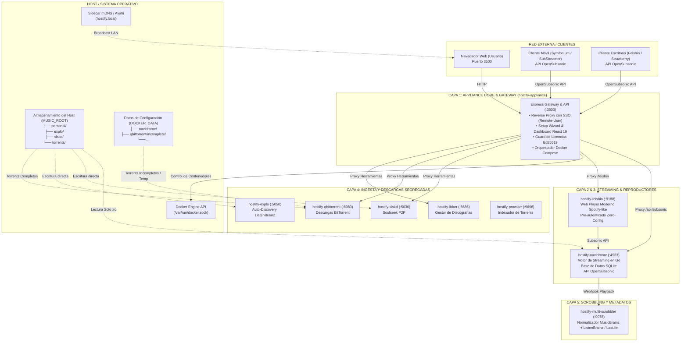

# 🎧 Hostify: Especificación y Descripción Completa del Producto

**Versión:** 1.0.0  
**Fecha de Publicación:** Octubre 2026  
**Estado:** Producción / Appliance Listo para Distribución  

---

## 📑 Tabla de Contenidos

1. [Visión General y Propuesta de Valor](#1-visión-general-y-propuesta-de-valor)
2. [Experiencia de Usuario y Flujos (UX / DX)](#2-experiencia-de-usuario-y-flujos-ux--dx)
3. [Diagrama General de Arquitectura](#3-diagrama-general-de-arquitectura)
4. [Desglose Detallado de Capas del Sistema](#4-desglose-detallado-de-capas-del-sistema)
   - [Capa 0: Orquestación, Host y Motor de Contenedores](#capa-0-orquestación-host-y-motor-de-contenedores)
   - [Capa 1: Appliance Core & Gateway (Hostify Appliance)](#capa-1-appliance-core--gateway-hostify-appliance)
   - [Capa 2: Motor de Streaming & Compatibilidad Subsonic (Navidrome)](#capa-2-motor-de-streaming--compatibilidad-subsonic-navidrome)
   - [Capa 3: Ecosistema de Clientes y Reproductores](#capa-3-ecosistema-de-clientes-y-reproductores)
   - [Capa 4: Capa de Ingesta y Descargas Segmentadas](#capa-4-capa-de-ingesta-y-descargas-segmentadas)
   - [Capa 5: Scrobbling, Normalización y Enriquecimiento de Metadatos](#capa-5-scrobbling-normalización-y-enriquecimiento-de-metadatos)
   - [Capa 6: Redes, Conectividad y Acceso Remoto](#capa-6-redes-conectividad-y-acceso-remoto)
5. [Modelo de Almacenamiento e Integridad de Datos](#5-modelo-de-almacenamiento-e-integridad-de-datos)
6. [Seguridad, Permisos y Privacidad](#6-seguridad-permisos-y-privacidad)
7. [Estructura del Proyecto y Componentes del Repositorio](#7-estructura-del-proyecto-y-componentes-del-repositorio)

---

## 1. Visión General y Propuesta de Valor

### 1.1 ¿Qué es Hostify?
**Hostify** es un *appliance* de software llave en mano que unifica y automatiza una nube privada de streaming de música en alta fidelidad (Hi-Res FLAC, Opus, ALAC, MP3). Convierte un stack técnico complejo de múltiples microservicios Docker en una experiencia de usuario análoga a **Spotify** o **Apple Music**, pero ejecutada bajo control 100% propio del usuario, en su propio hardware (ordenador personal macOS/Windows/Linux o servidor NAS tipo Synology, Ugreen, QNAP o TrueNAS).

### 1.2 El Problema que Resuelve
Hasta la aparición de Hostify, el usuario se enfrentaba a dos alternativas insatisfactorias:

| Factor | Servicios de Streaming Centralizados (Spotify, Apple Music) | Homelab Tradicional Auto-Hospedado | **Hostify Appliance** |
| :--- | :--- | :--- | :--- |
| **Propiedad de la Música** | Ninguna (alquiler temporal de catálogo; las canciones desaparecen por licencias). | Total (archivos propios en disco). | **Total (archivos propios en disco).** |
| **Calidad de Audio** | Pérdida de compresión o recargos por planes Hi-Fi. | Lossless bit-perfect (FLAC/DSD). | **Lossless bit-perfect (FLAC/DSD).** |
| **Complejidad de Instalación** | Muy fácil (descargar app). | Extremadamente alta (YAML, terminal, permisos Linux, reverse proxies manuales). | **Extremadamente fácil (1 solo comando y Setup Wizard web).** |
| **Consumo de Recursos** | En la nube. | Variable, frecuentemente pesado. | **Ultra liviano (< 60 MB RAM en el motor de streaming).** |
| **Privacidad** | Monitoreo continuo de hábitos y telemetría comercial. | Privado. | **100% privado, sin telemetría, modo local-first.** |
| **Descubrimiento y Automatización** | Algoritmos propietarios cerrados. | Configuración manual e inconexa de scripts. | **Automatizado (Soulseek, ListenBrainz, BitTorrent, integración inteligente).** |

### 1.3 Audiencia Objetivo
1. **Audiófilos y Coleccionistas:** Usuarios con amplias colecciones de música en FLAC/MP3 que buscan una forma cómoda y moderna de reproducirlas en todos sus dispositivos (móvil, coche vía CarPlay/Android Auto, ordenador de trabajo, equipo de sonido de salón) sin depender de suscripciones mensuales.
2. **Entusiastas de NAS y Homelabs:** Propietarios de servidores domésticos que desean una solución robusta, mantenible y desacoplada sin dedicar horas a la configuración manual de archivos `docker-compose.yml`.
3. **Usuarios No Técnicos:** Personas que desean independencia digital y privacidad pero no están familiarizadas con comandos de consola, asignación de permisos Unix (`chown`/`chmod`) ni configuración de certificados SSL.

---

## 2. Experiencia de Usuario y Flujos (UX / DX)

### 2.1 Instalación Zero-Friction (One-Liner)
Hostify se instala mediante un único comando en el sistema operativo anfitrión:
- **macOS / Linux / NAS:**
  ```bash
  curl -fsSL https://raw.githubusercontent.com/.../install.sh | bash
  ```
- **Windows (PowerShell):**
  ```powershell
  irm https://raw.githubusercontent.com/.../install.ps1 | iex
  ```

#### Qué hace el instalador automáticamente:
1. **Detección del Entorno de Contenedores:** Comprueba si Docker está disponible.
   - En **macOS**: Si Docker Desktop no está presente, descarga e inicializa **Colima** (motor de virtualización ligero y open-source) y lo configura en `brew services` para que inicie automáticamente con el login del sistema.
   - En **Linux / NAS**: Descarga e instala Docker Engine oficial si falta y habilita el demonio mediante `systemctl enable --now docker`.
   - En **Windows**: Verifica Docker Desktop o lo instala vía `winget`.
2. **Generación de Red y Parámetros Base:** Genera claves aleatorias de seguridad y levanta el contenedor `hostify-appliance` en el puerto `3500`.
3. **Apertura Automática del Navegador:** Redirige al usuario inmediatamente a `http://hostify.local:3500` para iniciar el asistente de bienvenida.

---

### 2.2 Asistente de Configuración Inicial (Setup Wizard en 6 Pasos)

El Setup Wizard guía al usuario a través de un flujo intuitivo, eliminando cualquier decisión técnica compleja:

```
[Paso 1: Diagnóstico] ➔ [Paso 2: Acceso Remoto] ➔ [Paso 3: Biblioteca] ➔ [Paso 4: Módulos] ➔ [Paso 5: Cuentas] ➔ [Paso 6: Despliegue en Vivo]
```

1. **Paso 1 - Diagnóstico del Host:** Detección automática del hardware, memoria RAM disponible, sistema operativo, zona horaria y usuario UID/GID.
2. **Paso 2 - Topología de Acceso Remoto:** Permite elegir entre tres modalidades:
   - *Solo Red Local (LAN):* Acceso directo mediante `http://hostify.local:3500`.
   - *Red Segura Tailscale:* Detección automática de Tailscale en el host, permitiendo streaming seguro fuera de casa con 0 puertos abiertos en el router y sin tocar NAT.
   - *Proxy Reverso Propio:* Generación automática de snippets listos para copiar y pegar para Caddy, Nginx, Traefik o Cloudflare Tunnels con soporte SSL y WebSockets.
3. **Paso 3 - Almacenamiento de Música:**
   - Incorpora un **explorador nativo visual de carpetas del host** que permite navegar por los discos duros, carpetas de usuario o volúmenes montados sin escribir rutas manualmente.
   - Crea automáticamente la estructura segregada de carpetas (`personal/`, `explo/`, `slskd/`, `torrents/`).
4. **Paso 4 - Selección Modular de Microservicios:**
   - Servicios base obligatorios: Navidrome (streaming), Feishin (reproductor web) y Multi-Scrobbler (metadatos).
   - Módulos opcionales activables en 1 clic: **Slskd** (Soulseek P2P), **Explo** (descubrimiento semanal), **qBittorrent** (descargas torrents), **Prowlarr** (indexadores) y **Lidarr** (gestión de discografías).
5. **Paso 5 - Cuentas de Acceso y Scrobbling:**
   - Configuración de usuario administrador de Navidrome.
   - Integración opcional con **ListenBrainz**: validación del token de usuario en tiempo real contra la API de ListenBrainz para auto-completar el nombre de usuario y sincronizar el scrobbling.
6. **Paso 6 - Despliegue con Terminal y Logs en Vivo:**
   - Modal interactivo con emulador de terminal que transmite en tiempo real la descarga de imágenes Docker, creación de redes, arranque de contenedores y sincronización inicial de la base de datos de música.
   - Notificación de sistema listo y redirección directa al Dashboard.

---

### 2.3 Dashboard Operativo Unificado
Una vez finalizado el onboarding, la aplicación presenta una interfaz de control integral dividida en pestañas temáticas:
- **Resumen del Sistema:** Indicadores de estado de salud (Healthy / Starting / Stopped), consumo de CPU y memoria RAM en tiempo real por cada contenedor, y botón de reinicio individual.
- **Centro de Reproductores y Clientes:**
  - Acceso directo a **Feishin Web** (embebido o en pestaña separada con autenticación automática).
  - Acceso a **Navidrome Web UI**.
  - Enlaces de descarga y parámetros de conexión (URL de Subsonic, credenciales) formateados para clientes móviles (Symfonium, SubStreamer, Amperfy).
- **Inspección de Biblioteca y Almacenamiento:**
  - Contador de pistas totales con desglose en tiempo real por cada subcarpeta de ingesta (`personal`, `explo`, `slskd`, `torrents`).
  - Botón de **Sincronización Inmediata ("Sync Now")** que dispara un escaneo profundo en Navidrome.
- **Herramientas de Ingesta:** Accesos directos pre-autenticados a las interfaces web de Slskd, qBittorrent, Lidarr, Prowlarr y Multi-Scrobbler.
- **Gestión de Licencias:** Modal para visualizar el estado de activación, período de prueba de 14 días o ingreso de licencia de por vida Ed25519 con verificación offline.
- **Soporte Multilingüe:** Selector dinámico de idioma (Español / Inglés) con persistencia en cliente.

---

## 3. Diagrama General de Arquitectura

El siguiente diagrama ilustra la interacción entre las diferentes capas, puertos, redes internas y volúmenes montados:



---

## 4. Desglose Detallado de Capas del Sistema

### Capa 0: Orquestación, Host y Motor de Contenedores

- **Motor Docker:** Hostify opera de manera agnóstica sobre cualquier motor compatible con Docker Engine API v1.24+:
  - Docker Desktop (macOS / Windows).
  - Colima (macOS sin licencia de Docker Desktop comercial).
  - Docker CE nativo (Ubuntu, Debian, Fedora, Arch, Alpine).
  - Sistemas operativos de NAS: DSM (Synology), UGOS (Ugreen), QTS (QNAP), TrueNAS SCALE y Unraid.
- **Red Aislada (`hostify-net`):** Red de tipo puente (*bridge*) creada por Docker Compose con subred dedicada. Todos los contenedores se comunican internamente mediante sus nombres DNS de servicio (`hostify-navidrome`, `hostify-slskd`, `hostify-feishin`), aislando los puertos internos del exterior a menos que se expongan deliberadamente.
- **Sidecar mDNS / Avahi (`hostify-avahi`):** Contenedor sidecar ejecutado en `network_mode: host` que transmite paquetes de anuncio multicast en la red local. Esto permite a cualquier dispositivo de la casa (iPhone, Mac, Android, PC) escribir simplemente `http://hostify.local:3500` en su navegador sin necesidad de memorizar direcciones IP locales como `192.168.1.150`.
- **Control de Permisos de Usuario (`PUID` / `PGID`):** El motor lee el UID y GID del usuario propietario del host (habitualmente 1000 en Linux o 501 en macOS). Todos los contenedores de descarga ejecutan sus procesos bajo dicho identificador, evitando que los archivos generados queden como propiedad de `root` y sean imposibles de mover o editar por el usuario.

---

### Capa 1: Appliance Core & Gateway (Hostify Appliance)

Es el cerebro del producto. Se aloja en el contenedor `hostify-appliance` y está compuesto por:

1. **Backend Modular (Node.js 22 LTS / Express):**
   - **Compilación Bytenode V8:** El backend se compila a bytecode binario nativo de V8 antes de la distribución (`dist/server.bundle.jsc`). Esto proporciona una velocidad de inicio casi instantánea y protege la propiedad intelectual y lógica de licenciamiento contra ingeniería inversa trivial.
   - **Reverse Proxy Transparente:** Redirige las peticiones entrantes a Navidrome, Feishin, Slskd, Lidarr, Prowlarr y qBittorrent bajo un mismo puerto HTTP (`3500`).
   - **Single Sign-On (SSO) Automático:** Cuando el usuario accede a la interfaz web de Navidrome o Feishin a través del portal de Hostify, el proxy inyecta de forma segura el encabezado `Remote-User: admin`, permitiendo que el usuario ingrese a su música sin pantallas de login intermedias.
   - **API de Orquestación y Despliegue (`compose.service.ts`):** Gestiona la ejecución de `docker compose`, inyectando las variables de entorno validadas del archivo `.env`, transmitiendo logs en streaming y disparando reintentos automáticos en caso de latencia de red.
2. **Motor Criptográfico de Licencias Offline (`license.service.ts`):**
   - Basado en el algoritmo de firmas asimétricas **Ed25519**.
   - Cada clave de licencia contiene una carga útil en base64 con el ID de cliente, fecha de emisión, tipo de plan y firma digital.
   - La verificación se realiza **100% en local** con una clave pública pre-embebida; no requiere conexión a ningún servidor de activación externo, garantizando operatividad perpetua incluso si no hay conexión a Internet.
   - Incluye un período de evaluación completa de **14 días de prueba** sin restricciones.
3. **Frontend SPA (React 19 + TypeScript + Vite):**
   - Interfaz gráfica limpia, de alto contraste (Dark Theme moderno), diseñada siguiendo estándares de microinteracciones, tipografía sans-serif optimizada y componentes desacoplados.
   - Gestión de estado ligero sin dependencias pesadas tipo Redux.
   - Motor de internacionalización en caliente (`i18n.tsx`) con soporte bilingüe integral.

---

### Capa 2: Motor de Streaming & Compatibilidad Subsonic (Navidrome)

- **Núcleo de Streaming:** Utiliza **Navidrome**, un servidor de medios ultra eficiente programado en **Go**. Consume habitualmente entre 30 y 60 MB de memoria RAM, frente a gigabytes que demandan alternativas como Plex o Jellyfin.
- **Modo Solo Lectura (`:ro`):** La carpeta `/music` se monta estrictamente con el modificador `:ro`. Navidrome indexa los metadatos de las pistas pero **jamás puede modificar, sobreescribir ni borrar** los archivos de música originales del usuario.
- **Soporte de Formatos:** Lee de forma nativa FLAC, ALAC, MP3, OGG, Opus, AAC, M4A, DSF y WAV. Permite transcodificación en tiempo real a Opus o MP3 para conexiones con ancho de banda móvil reducido.
- **Compatibilidad con la API OpenSubsonic:** Soporta la especificación completa del protocolo Subsonic v1.16.1. Cualquier cliente móvil o de escritorio creado en los últimos 15 años para Subsonic, Airsonic o LMS es compatible de forma instantánea con Hostify.

---

### Capa 3: Ecosistema de Clientes y Reproductores

Hostify no obliga al usuario a usar un único reproductor propietario, sino que le brinda un ecosistema de clientes premium:

| Cliente | Plataforma | Tipo | Aspectos Destacados |
| :--- | :--- | :--- | :--- |
| **Feishin Web** | Navegador (Embebido) | Web | Interfaz idéntica a Spotify para la web, visualizador de audio, letras sincronizadas en tiempo real, pre-autenticación Zero-Config con Navidrome. |
| **Feishin Desktop** | macOS, Windows, Linux | Nativo | Cliente de escritorio de código abierto con reproducción sin pausas (*gapless*), soporte para audio bit-perfect, ecualizador y atajos de teclado multimedia globales. |
| **Symfonium** | Android / Android Auto | Móvil | El cliente de audio de referencia absoluto en Android: ecualizador paramétrico completo, soporte de ganancia de volumen ReplayGain, caché offline inteligente de listas y soporte nativo para Android Auto. |
| **SubStreamer / Amperfy** | iOS / CarPlay | Móvil | Clientes fluidos para iPhone y iPad con soporte completo para Apple CarPlay, descarga de canciones en segundo plano y reproducción sin pérdida. |
| **Kodi / Sonixd / Strawberry** | Smart TVs, Linux, HTPC | Especializado | Reproducción en salas de estar y centros multimedia con soporte para audio multicanal y carátulas de alta resolución. |

---

### Capa 4: Capa de Ingesta y Descargas Segmentadas

Para alimentar y expandir la fonoteca personal de forma automática, Hostify integra herramientas de ingesta que depositan la música en carpetas dedicadas:

1. **Slskd (Soulseek P2P Headless):**
   - Cliente web moderno para la red P2P Soulseek, la mayor red comunitaria para encontrar música independiente, grabaciones raras, directos y discos descatalogados en formato FLAC.
   - Hostify lo pre-configura con usuario generado y depósito automático en `MUSIC_ROOT/slskd/`.
2. **Explo (Descubrimiento y Curaduría Automatizada):**
   - Herramienta de sincronización que conecta con listas de descubrimiento semanal de ListenBrainz o Spotify.
   - Descarga automáticamente pistas recomendadas en `MUSIC_ROOT/explo/` y genera listas de reproducción inteligentes para descubrir nueva música sin intervención manual.
3. **Combo Lidarr + Prowlarr + qBittorrent:**
   - **Prowlarr:** Indexador centralizado de torrents públicos y privados que provee fuentes a Lidarr.
   - **Lidarr:** Monitor de discografías. Permite buscar un artista, seleccionar qué álbumes faltan en la colección y ordenar su descarga en la calidad de audio deseada.
   - **qBittorrent:** Motor de descargas BitTorrent de alto rendimiento.
   - **Aislamiento de Descargas Incompletas:** Los archivos en progreso se descargan en `DOCKER_DATA/qbittorrent/incomplete`. Solo cuando un torrent alcanza el 100% de descarga y se verifica su hash SHA, qBittorrent mueve el archivo a `MUSIC_ROOT/torrents/`. Esto impide que Navidrome intente indexar un archivo a medio descargar, protegiendo la base de datos contra errores de lectura.

---

### Capa 5: Scrobbling, Normalización y Enriquecimiento de Metadatos

- **Multi-Scrobbler:** Contenedor especializado que actúa como intermediario entre Navidrome y los servicios globales de historial musical.
- **Desacoplamiento:** A diferencia del scrobbler interno de Navidrome, Multi-Scrobbler procesa las reproducciones en cola asíncrona: si se pierde la conexión a Internet temporalmente durante un viaje, los scrobbles se guardan en un búfer local y se envían cuando vuelve la red.
- **Normalización MusicBrainz:** Limpia automáticamente las etiquetas de artistas y álbumes para garantizar que no existan duplicados (por ejemplo, unificando `"The Beatles"` y `"Beatles, The"`).
- **Destino ListenBrainz / Last.fm:** Envía los registros de escucha a la plataforma abierta **ListenBrainz** de la fundación MetaBrainz, permitiendo que el usuario sea dueño de su propio historial de reproducciones de por vida.

---

### Capa 6: Redes, Conectividad y Acceso Remoto

Hostify provee tres mecanismos de conectividad para que la música esté siempre accesible:

1. **Red de Área Local (LAN):**
   - Acceso inmediato mediante mDNS: `http://hostify.local:3500`.
   - Resolución por IP estática o asignada por DHCP en el router.
2. **Acceso Mesh con Tailscale (Recomendado para Máxima Seguridad):**
   - Conexión punto a punto mediante el protocolo **WireGuard**.
   - No requiere abrir ningún puerto en el router de casa ni lidiar con CGNAT (típico en conexiones de fibra óptica modernas y redes 4G/5G).
   - Acceso a través de la IP de Tailscale del host o su nombre en MagicDNS (ej. `http://mi-servidor.tailnet.ts.net:3500`).
3. **Exposición Pública mediante Proxy Reverso:**
   - Para usuarios que desean un dominio público propio (ej. `https://musica.mi-dominio.com`) con certificado SSL Let's Encrypt.
   - El Setup Wizard genera automáticamente las directivas exactas de configuración para:
     - **Caddy Server:** Configuración ultra-compacta con HTTPS automático.
     - **Nginx:** Bloque de servidor con encabezados de proxying, websockets y buffers de streaming.
     - **Traefik:** Etiquetas de contenedores (*labels*).
     - **Cloudflare Tunnels:** Configuración Zero-Trust sin IP pública expuesta.

---

## 5. Modelo de Almacenamiento e Integridad de Datos

### 5.1 Estructura del Árbol de Directorios
Hostify estructura el almacenamiento en dos grandes directorios desacoplados:

```text
Directorio de Música (MUSIC_ROOT)
├── personal/                     # Colección propia (copias de CDs, vinilos, compras Bandcamp)
│   └── [Artista]/[Álbum]/[Pista].flac
├── explo/                        # Descargas generadas por el descubridor Explo
├── slskd/                        # Descargas directas de Soulseek P2P
└── torrents/                     # Álbumes completos descargados vía qBittorrent / Lidarr

Directorio de Aplicación y Caché (DOCKER_DATA)
├── navidrome/data/               # Base de datos SQLite de Navidrome, carátulas en caché
├── qbittorrent/incomplete/       # Búfer de archivos temporales en descarga
├── lidarr/config/                # Configuración y base de datos de Lidarr
├── prowlarr/config/              # Configuración de indexadores de Prowlarr
├── slskd/config/                 # Configuración de Slskd
└── multi-scrobbler/config/       # Base de datos de scrobbles en cola
```

### 5.2 Beneficios del Modelo Segregado
1. **Indexación Limpia:** Navidrome monta únicamente `MUSIC_ROOT` en modo `:ro`. Al realizar el escaneo recursivo, todas las subcarpetas se consolidan en una única discografía unificada ante los ojos del usuario.
2. **Trazabilidad:** El usuario siempre sabe de dónde provino cada pista o álbum inspeccionando la subcarpeta de origen.
3. **Cero Corrupción por Archivos Incompletos:** Al mantener las descargas en progreso en `DOCKER_DATA/qbittorrent/incomplete`, Navidrome jamás intentará leer metadatos de un archivo a medio escribir, evitando bloqueos en el escaneo o etiquetas ID3 truncadas.

---

## 6. Seguridad, Permisos y Privacidad

1. **Aislamiento en Contenedores:** Ningún microservicio corre directamente sobre el sistema operativo anfitrión. Si un contenedor se detiene o falla, no afecta al resto del sistema.
2. **Protección de Permisos de Escritura:** El servicio de streaming (Navidrome) no posee permisos de escritura sobre la música. Es físicamente imposible que un error de software o una vulnerabilidad externa borre la colección de música.
3. **Cero Dependencia de Servidores Externos:** Hostify no depende de que los servidores de la empresa sigan encendidos. Toda la validación de licencias, streaming y base de datos funciona en local de manera indefinida.
4. **Privacidad Absoluta:** No se recolectan estadísticas de uso, IPs de los usuarios, nombres de canciones reproducidas ni ningún tipo de telemetría.

---

## 7. Estructura del Proyecto y Componentes del Repositorio

El repositorio de Hostify está organizado de la siguiente manera:

```text
hostify/
├── app/                                # Código fuente de Hostify Appliance Core
│   ├── server/                         # Backend en TypeScript (Express)
│   │   ├── routes/                     # Rutas API (/status, /setup, /storage, /license, /proxy)
│   │   ├── services/                   # Lógica de negocio (docker, compose, subsonic, license, storage)
│   │   ├── types/                      # Definiciones de tipos TypeScript
│   │   └── utils/                      # Utilidades de entorno (.env parser)
│   ├── src/                            # Frontend en TypeScript (React 19 + Vite)
│   │   ├── components/                 # Componentes UI (Navbar, SetupWizard, Dashboard, LicenseModal)
│   │   ├── i18n.tsx                    # Sistema de internacionalización ES / EN
│   │   └── types.ts                    # Interfaces de estado de la aplicación
│   ├── templates/                      # Plantillas internas empaquetadas (docker-compose.yml)
│   ├── Dockerfile                      # Imagen multi-stage con compilación Bytenode V8
│   └── package.json                    # Dependencias gestionadas obligatoriamente con pnpm
├── docker/                             # Plantillas y configuraciones auxiliares de contenedores
│   └── feishin/settings.js.template    # Plantilla de pre-autenticación Zero-Config para Feishin
├── docs/                               # Documentación completa del producto
│   ├── DESCRIPCION_DEL_PRODUCTO.md     # Este documento (especificación completa del sistema)
│   ├── TIENDA_Y_DISTRIBUCION.md        # Análisis y estrategia de comercialización digital
│   └── README.es.md                    # Manual de usuario en Español
├── scripts/                            # Herramientas criptográficas y utilidades de compilación
│   ├── keygen.ts                       # Generador de licencias Ed25519 individuales
│   └── bulk-keygen.ts                  # Generador por lotes de licencias para venta en tiendas
├── docker-compose.yml                  # Orquestación completa de desarrollo y despliegue local
├── docker-compose.prod.yml             # Orquestación de producción para NAS / servidores
├── install.sh                          # Script de instalación automática para macOS / Linux / NAS
├── install.ps1                         # Script de instalación automática para Windows PowerShell
├── README.md                           # Documentación principal en Inglés
└── AGENTS.md                           # Reglas de arquitectura y desarrollo del proyecto
```

---

*Hostify — Tu música, tu servidor, tus reglas.*
